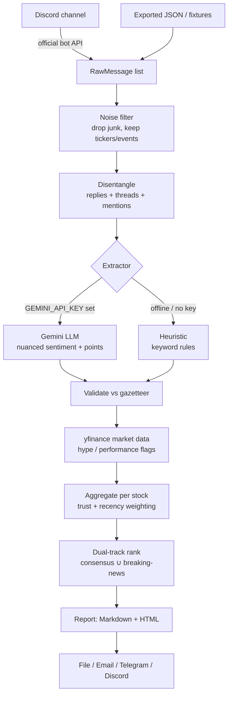

# 📊 discord-stock-digest

Turn a day of noisy Discord stock chatter into a clean, ranked, evidence-backed
**daily digest** — which stocks people talked about, what they said, who's
bullish vs bearish, what's hyped, and what big news broke.

Built to run on **free APIs**: Google Gemini's free tier for the language
understanding, `yfinance` for market data, and the official Discord bot API for
reading messages. It also runs **fully offline** with bundled sample data — no
keys required to try it.

```
$ python main.py --selftest

  Digest for #stocks — 2026-07-17
  20/27 messages analysed · extractor=heuristic
============================================================
   1. Reliance Industries   RELIANCE.NS  BUY    sent=+0.92  — top consensus + breaking news
   2. Tata Motors           TATAMOTORS.NS HOLD   sent=+0.00  — top consensus + breaking news
   3. Rail Vikas Nigam      RVNL.NS      UNCLEAR sent=+0.00  — breaking news (order win, low-trust user!)
   4. Suzlon Energy         SUZLON.NS    BUY     sent=-0.33  — trusted voices flip the hype
   ...
```

> ⚠️ **Not investment advice.** This summarises what people in a chat said. It
> does not verify claims. Do your own research.

---

## The one thing to know first: reading the channel

If you are a **member but not the owner** of the Discord server, you **cannot
add a bot yourself** — Discord requires the *Manage Server* permission. There
is exactly one compliant way to read a channel:

**✅ Ask a server owner/admin to add your bot** (a 5-minute favour). Full
step-by-step + a copy-paste message is in **[docs/owner_message.md](docs/owner_message.md)**.

**🚫 Do NOT use a "self-bot" or export with your personal account token.** That
automates a user account, which is an explicit Discord ToS violation and risks
**permanent account termination** (enforcement increased through 2025–2026).
If the owner won't add a bot, the feature simply isn't available on that server.

Everything else in this project is clean and free.

---

## Features

- 📥 **Reads one channel** via the official Discord bot API (or an exported JSON
  file, or bundled fixtures).
- 🧵 **Disentangles conversations** — links interleaved multi-person messages
  into coherent threads using Discord's reply/thread/@mention signals.
- 🎯 **Extracts per-stock opinions** — sentiment, buy/avoid call, case-study /
  outlook / risk points — with a **verbatim evidence quote** for each.
- 🛡️ **No hallucinated tickers** — every symbol is validated against a
  gazetteer (`data/symbols.csv`, NSE/BSE + US), with `$cashtag` and colloquial
  alias support ("RIL", "Bank Nifty").
- 🔇 **Ignores noise** — greetings, emoji, links, bot posts — but never drops a
  message that mentions a stock or a market event.
- ⭐ **Trusted-user weighting** — reliable members' views count for more (config).
- 🔥 **Hype / doing-well-or-badly** — augments chat with `yfinance` price,
  volume-spike and news-count signals.
- 📰 **Never misses big news** — a *dual-track* ranker surfaces top consensus
  **and** weight-agnostic breaking news (so an order win posted by an unknown
  user still shows up).
- 📤 **Delivers anywhere** — Markdown + self-contained HTML, to a file, email,
  Telegram, or back into Discord via webhook.
- 🧪 **Runs offline** — `--selftest` needs no keys; 18 unit tests included.

---

## How it works



See **[docs/ARCHITECTURE.md](docs/ARCHITECTURE.md)** for the full design.

---

## Quickstart (offline, no keys)

```bash
git clone https://github.com/sachincse/discord-stock-digest
cd discord-stock-digest
pip install -r requirements.txt      # only PyYAML is needed for --selftest
python main.py --selftest            # runs on bundled sample chat
```

Open the generated `out/digest_YYYYMMDD.html` in a browser, or see the
committed example at [docs/sample_digest.md](docs/sample_digest.md).

---

## Real usage

**👉 Full step-by-step (with the exact Discord Developer Portal click-path, key
setup, a config table, deployment, and troubleshooting) is in
[docs/SETUP.md](docs/SETUP.md).** The short version:

1. **Create the bot** → enable **Message Content Intent** → have a server admin
   add it (see [docs/owner_message.md](docs/owner_message.md)).
2. **Get a free Gemini key** at <https://aistudio.google.com/apikey> (keep
   billing disabled for the free tier). No key? It auto-falls back to the
   offline heuristic extractor.
3. **Configure:**
   ```bash
   cp .env.example .env                 # DISCORD_BOT_TOKEN, DISCORD_CHANNEL_ID, GEMINI_API_KEY
   cp config.example.yaml config.yaml   # trusted_users, top_n, delivery channels
   ```
4. **Run:**
   ```bash
   python main.py --once --live-market            # one live run, real market data
   python main.py --from-json data/export.json    # analyse an exported file
   python main.py --schedule --at 21:30           # run daily at 21:30 local
   ```

> 🔐 On Gemini's free tier Google may use inputs to improve its products. This
> tool anonymises usernames before sending (`anonymize_usernames: true`); use
> Gemini's cheap paid tier for fully private handling.

## Deploy for free (runs daily by itself)

The recommended zero-host option is the included **GitHub Actions** workflow
([.github/workflows/daily.yml](.github/workflows/daily.yml)): add four repo
secrets, and it runs the digest once a day and posts it to Discord via a
webhook. Full walkthrough in [docs/SETUP.md](docs/SETUP.md#8-deploy-for-free-runs-daily-by-itself)
(Windows Task Scheduler and cron alternatives included).

## How ranking works (no black box)

Every surfaced stock shows **why** it made the cut. Two independent tracks:

- **Track A — relevance (trust-weighted consensus):** `Σ(author_weight ×
  recency_decay ÷ tickers_in_message)`, boosted by how many distinct people
  discussed it, how strong the net sentiment is, and how substantive the points
  were. This answers *"what's worth my attention"*.
- **Track B — breaking news (weight-agnostic):** a concrete event (results,
  order win, circuit, SEBI/RBI action) crosses the threshold **on its own**, and
  volume/news spikes stack on top. This answers *"what must I not miss"* — even
  if only one low-trust user posted it.

Surfaced set = `top-N(Track A) ∪ {Track B over threshold}`. Trust weights are
applied in code, never fed to the LLM. Tune it all in `config.yaml`.

---

## Configuration

Secrets live in `.env`; tuning lives in `config.yaml` (see
[config.example.yaml](config.example.yaml)). Highlights:

| Key | Meaning |
|---|---|
| `trusted_users` | `name: weight` map; higher = counts for more |
| `trusted_threshold` | weight ≥ this → shown under "Trusted voices" |
| `top_n` | how many consensus stocks to surface |
| `breaking_news_threshold` | 0–1; lower = surface more "big news" items |
| `recency_half_life_hours` | how fast older mentions lose weight |
| `gemini_model` | `gemini-2.5-flash` or `gemini-2.5-flash-lite` |
| `anonymize_usernames` | scrub real names before sending to the LLM |
| `report.*` | enable file / email / telegram / discord delivery |

Add stocks by appending rows to `data/symbols.csv`.

---

## Development

```bash
python -m pytest -q          # 18 tests, all offline
python main.py --selftest    # end-to-end smoke test
```

Project layout and how to extend (new extractor / market source / delivery
channel) are documented in [docs/ARCHITECTURE.md](docs/ARCHITECTURE.md).

---

## Roadmap & prior art

Designed after surveying mature social-stock tools and Discord summarizers
(SimplySummary, ApeWisdom, SwaggyStocks, Alpha Scientist, and more) — which
validated the core design and shaped what's built vs. planned. See
[docs/ROADMAP.md](docs/ROADMAP.md) for the comparison table and the backlog
(SQLite trend-tracking, map-reduce for busy days, an optional transformer
extractor, a dedicated hype score, cost guardrails). PRs welcome.

## Free-API cheat sheet (2026)

| Need | Free option | Notes |
|---|---|---|
| Read channel | Discord bot API | owner must add the bot; Message Content Intent free < 10k users |
| Language/AI | Gemini free tier | 2.5 Flash/Flash-Lite, 1M ctx; anonymise or go paid for privacy |
| Market data | `yfinance` | US **and** Indian (`.NS`/`.BO`); batch calls to dodge 429s |
| Fallback LLM | Groq / OpenRouter | swap via the `Extractor` protocol |

---

## License

MIT — see [LICENSE](LICENSE). Built by [@sachincse](https://github.com/sachincse).
Community-chatter summariser, **not** financial advice.
